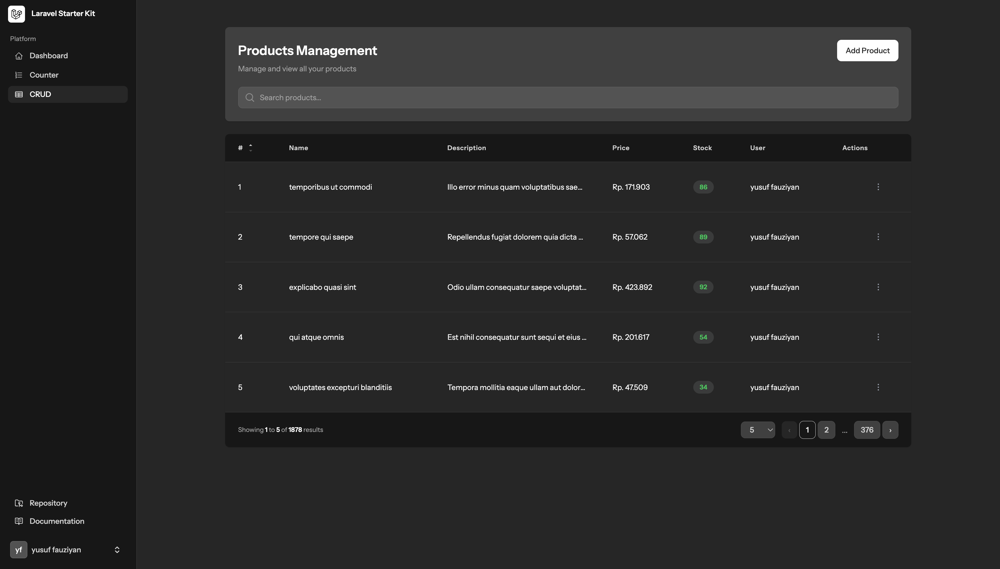
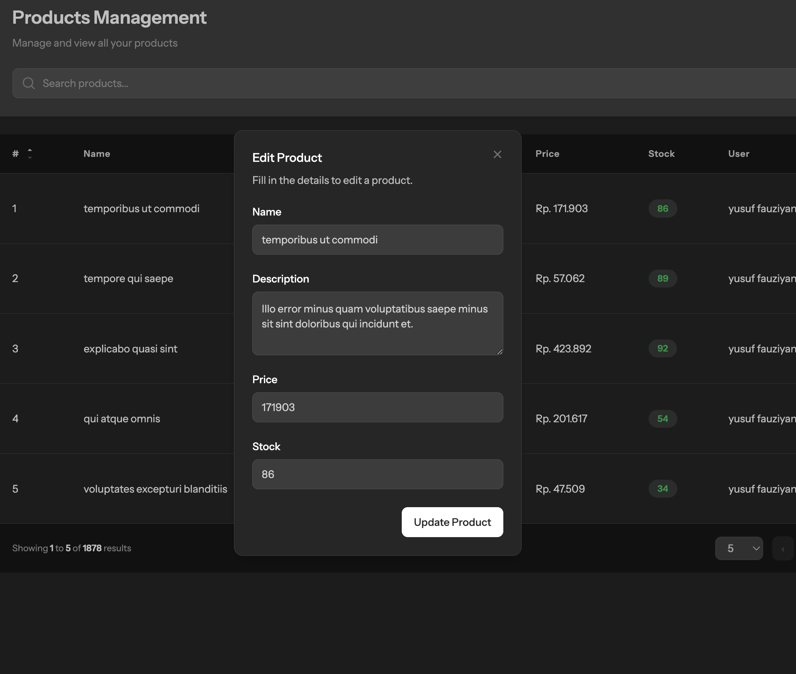

````markdown
# 🚀 Product Management System

A simple **Product Management** application built with **Laravel 12** (PHP 8.4),  
using **Livewire Volt**, **Flux UI**, and **TailwindCSS**.

This project demonstrates a clean implementation of CRUD operations with modern Laravel tools, including search, sort, pagination, and modal-based forms.

---

## ✨ Features

- ✅ Add, Edit, Delete Products  
- ✅ Modal-based forms with Livewire & Flux  
- ✅ Search with debounce  
- ✅ Sorting by multiple columns  
- ✅ Pagination with customizable page size  
- ✅ TailwindCSS-based styling (Dark/Light mode supported)  
- ✅ State persistence via Livewire query strings  

---

## 🛠️ Tech Stack

- **Backend:** Laravel 12, PHP 8.4  
- **Frontend:** TailwindCSS, Flux UI  
- **Reactive Components:** Livewire Volt  
- **Database:** MySQL (default)  

---

## 📦 Installation

### 1. Clone the repository
```bash
git clone https://github.com/your-username/laravel-products.git
cd laravel-products
````

### 2. Install dependencies

```bash
composer install
npm install && npm run build
```

### 3. Setup environment

Copy `.env.example` to `.env` and update database credentials:

```bash
cp .env.example .env
```

Example:

```env
DB_CONNECTION=mysql
DB_HOST=127.0.0.1
DB_PORT=3306
DB_DATABASE=products_db
DB_USERNAME=root
DB_PASSWORD=
```

### 4. Generate app key

```bash
php artisan key:generate
```

### 5. Run migrations & seeders

```bash
php artisan migrate --seed
```

---

## ▶️ Running the App

Start the Laravel development server:

```bash
php artisan serve
```

Compile frontend assets in watch mode:

```bash
npm run dev
```

Now open [http://localhost:8000](http://localhost:8000) 🎉

---

## 📂 Project Structure

```
app/
 └── Http/Livewire/        # Livewire components
resources/
 ├── views/                # Blade templates
 │   ├── components/       # Shared UI components
 │   └── products.blade.php# Main product page
 └── css/                  # Tailwind styles
```

---

## 🖼️ Screenshots

### Product List



### Modal Form



---

## ⚡ Livewire + Volt + Flux Highlights

* **Volt**: Class-based Livewire components written inline with Blade for faster prototyping.
* **Flux**: Modern UI kit with beautiful components (`<flux:modal>`, `<flux:button>`, `<flux:input>`, etc.).
* **Tailwind**: Utility-first CSS framework for styling.

---

## 🤝 Contributing

1. Fork the repository
2. Create your feature branch (`git checkout -b feature/my-feature`)
3. Commit changes (`git commit -m 'Add new feature'`)
4. Push to branch (`git push origin feature/my-feature`)
5. Open a Pull Request

---

## 📜 License

This project is open-sourced under the [MIT License](LICENSE).